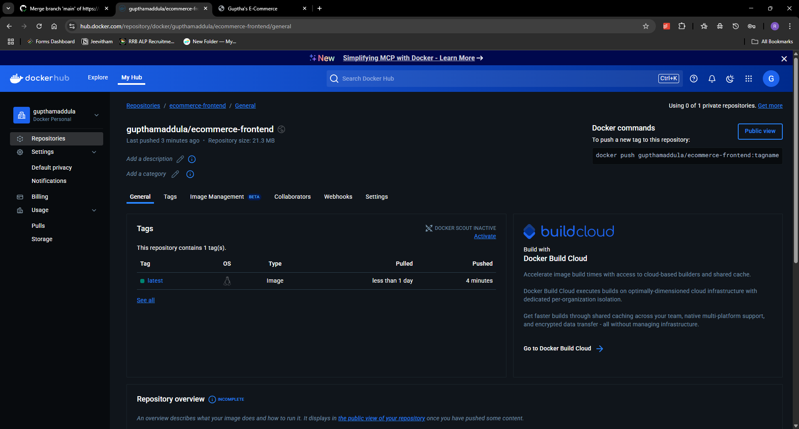

# E-Commerce Frontend Web App with CI/CD Pipeline using Docker and GitHub Actions


## Overview

This repository contains a **static E-Commerce frontend web application** that is fully dockerized and integrated with a **CI/CD pipeline** using GitHub Actions and Docker.

The pipeline automates:
- Building the Docker image
- Pushing it to Docker Hub
- Deploying it locally (or on any cloud server)


---

## Features

- Static frontend hosted via **Nginx** server.
- **Fully Dockerized** for containerized, consistent deployments.
- **CI/CD pipeline** set up with **GitHub Actions**.
- **Automatic build and push** of Docker images to **Docker Hub**.
- **Highly scalable** and can be deployed easily on cloud platforms like AWS, GCP, Azure, or on-premises.

---

## CI/CD Pipeline Flow

### 1. Code Push
- Pushing changes to `main` branch triggers **CI/CD workflow**.

### 2. Pipeline Steps

| Step | Description |
| :--- | :--- |
| Checkout | Pulls the latest code from repository |
| Docker Setup | Prepares Docker Build |
| Authenticate | Logs into Docker Hub using GitHub Secrets |
| Build & Push | Builds Docker image and pushes to Docker Hub |
| Running & Hosting | Optionally runs and hosts the app |

> **Workflow file:** `.github/workflows/ci-cd.yml`

---

## Deployment

After successful push to Docker Hub:

```bash
docker pull username/image_name
docker run -d --name cicd-container -p 80:80 image_name 
```

Application accessible at:

```bash
http://localhost:80
```

**Frontend Application Successfully Deployed!**


---

## Project Structure

```
ecommerce-frontend/
├── index.html              # Main Frontend File
├── Pictures/                 # Pictures and Outputs
├── Dockerfile              # Docker Build File
├── default.conf            # Nginx Custom Configuration
└── README.md               # Project Documentation
```

---

## Screenshots

| Screenshot | Description |
| :--- | :--- |
|  | Docker Container Running Successfully |
|  | Docker image pushed to Docker Hub |
|  | GitHub Actions CI/CD workflow completed |


---

## Learnings from This Project

- **Dockerization**: Creating reliable, repeatable Docker images.
- **CI/CD Pipelines**: End-to-end automation using GitHub Actions.
- **Secrets Management**: Securely handling Docker credentials in GitHub.
- **Deployment Automation**: Simplifying app delivery to any environment.
- **Real DevOps Practices**: Demonstrated full workflow of build, test, and deploy.

---

## Why This Project is Useful

- Demonstrates **Docker and CI/CD** skills practically.
- Provides an **Automation-ready** application.
- Highlights **industry best practices** in DevOps.
- Recruiters and companies can **quickly assess technical skills** through the pipeline.
- Ready for **further cloud deployments** (AWS ECS, Azure Container Apps, etc.).

---

## Local Setup

To run locally:

```bash
git clone https://github.com/gupthamaddula/repo-name.git
cd repo-name
```

Build and Run:

```bash
docker build -t ecommerce-frontend .
docker run -d -p 80:80 ecommerce-frontend
```

Open your browser and visit:

```bash
http://localhost:80
```

---

## GitHub Secrets Used

| Secret Name         | Purpose                                |
| :------------------ | :------------------------------------- |
| `DOCKER_USERNAME`   | Docker Hub username for authentication |
| `DOCKER_PASSWORD`   | Docker Hub password/token              |

Manage in:  
**GitHub → Repo → Settings → Secrets → Actions**

---

## Learnings

During this project, I gained hands-on experience with:

- **Docker Image Creation**: Learned how to write a proper `Dockerfile` for serving static websites using Nginx.
- **Docker Hub Integration**: Automated pushing of images to Docker Hub using secure GitHub Secrets.
- **GitHub Actions**: Designed and implemented a full CI/CD pipeline using workflows triggered by push events.
- **Secrets Management**: Understood how to safely manage credentials using GitHub Secrets to protect sensitive data.
- **Continuous Integration**: Gained real-world experience automating build and deployment processes to eliminate manual errors.
- **Nginx Configuration**: Customized Nginx to serve static frontend assets efficiently.
- **Error Handling and Debugging**: Troubleshot build errors in GitHub Actions and Docker locally to ensure smooth execution.
- **Deployment Readiness**: Built Docker images that are lightweight, production-ready, and portable across any server/cloud environment.
